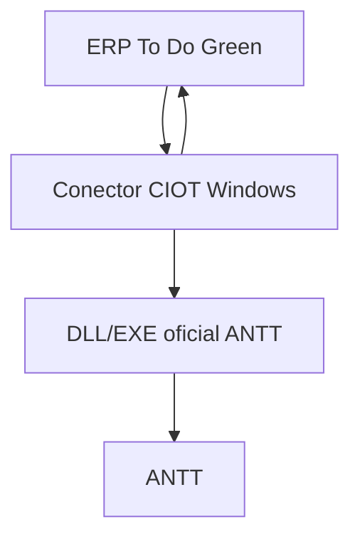

# CIOT direto sem IPEF

## Arquitetura



## Componentes

| Camada | Funcao | Status |
| --- | --- | --- |
| ERP To Do Green | Prepara CIOT, válida piso mínimo, guarda certificado, envia payload e registra retorno | Publicado |
| Conector CIOT | Recebe o payload do ERP e aciona o mecanismo oficial ANTT | Criado em `connectors/antt-ciot` com bootstrap Windows |
| DLL/EXE/DCS ANTT | Gera CIOT conforme DCS vigente | Bootstrap recebe URL ou arquivo local oficial |
| ANTT | Retorna CIOT/protocolo | Externo |

## Variáveis no ERP

| Campo | Valor |
| --- | --- |
| Base URL ANTT | URL de homologação ou produção conforme DCS |
| URL HTTPS do conector | `https://<host>/ciot` |
| Token do conector | Mesmo token configurado no microsserviço |
| Certificado | A1 enviado pelo ERP ou A3 resolvido localmente |

## Contrato de resposta

O ERP considera a emissão concluida quando o conector retorna HTTP 2xx com um dos campos abaixo contendo 12 dígitos:

| Campo aceito |
| --- |
| `ciotCode` |
| `ciot` |
| `codigoCiot` |
| `codigoCIOT` |
| `código` |
| `code` |
| `numeroCiot` |
| `numeroCIOT` |

## Pendencia tecnica real

Baixar o DCS e o pacote DLL/EXE da ANTT, validar a assinatura final da chamada e adaptar `AnttCiotProcessClient` ao formato oficial. O ERP não precisa mudar para essa etapa.

## Instalação Windows

O repositorio inclui `connectors/antt-ciot/scripts/bootstrap-windows.ps1`.

Esse script baixa pacote, DLL, EXE e DCS oficiais da ANTT quando as URLs sao informadas, pública o microsserviço, gera token interno, cria o arquivo de variáveis do ERP e instala o Windows Service. Ele precisa ser executado no servidor Windows que tera acesso ao certificado A1/A3 e aos artefatos oficiais da ANTT.

Comando base:

```powershell
.\bootstrap-windows.ps1 `
  -AnttExeUrl "https://url-oficial-da-antt/executavel-ciot-producao.exe" `
  -AnttDllUrl "https://url-oficial-da-antt/biblioteca-ciot-producao.dll" `
  -DcsUrl "https://url-oficial-da-antt/dcs-ciot.pdf" `
  -PublicConnectorUrl "https://ciot.todogreen.com.br"
```

Saídas principais:

| Saída | Uso |
| --- | --- |
| `secrets\connector-token.txt` | Token interno do conector |
| `ops\erp-ciot-connector.env` | Variáveis `TODOGREEN_ANTT_CIOT_CONNECTOR_URL` e `TODOGREEN_ANTT_CIOT_CONNECTOR_TOKEN` |
| `ops\antt-ciot-install-manifest.json` | Evidência de DCS, DLL, EXE e caminho do executavel |

Detalhe operacional completo: `docs/todogreen-ciot-operational-readiness.md`.
