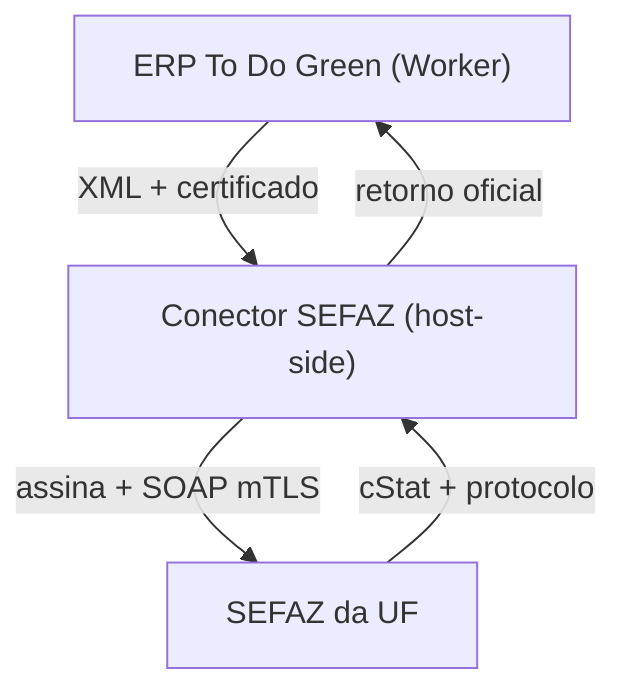

# Conector SEFAZ (CT-e modelo 57 e MDF-e modelo 58)

## Por que existe um conector

O Cloudflare Worker **não** assina documentos com o certificado ICP-Brasil nem
faz o mTLS que os web services da SEFAZ exigem. Assim como no CIOT/ANTT
(`connectors/antt-ciot`), a assinatura e a transmissão vivem num **conector
host-side** — um microsserviço no servidor da titular que guarda o certificado,
assina o XML (XML-DSig) e fala com a SEFAZ da UF. O ERP monta o XML, manda ao
conector e **só marca o documento como autorizado com o protocolo oficial**.



## Variáveis no cofre do Worker

| Variável | Uso |
| --- | --- |
| `NFE_CERT_PFX` | Certificado A1 em base64 (PFX). Enviado ao conector para assinar. |
| `NFE_CERT_PASSWORD` | Senha do PFX. |
| `SEFAZ_CONNECTOR_URL` | URL HTTPS do conector host-side (ex.: `https://sefaz.todogreen.com.br/transmitir`). |
| `SEFAZ_CONNECTOR_TOKEN` | (Opcional) Bearer token do conector. |
| `SEFAZ_CONNECTOR_ALLOWED_HOSTS` | Lista de hosts autorizados (o certificado sai daqui — o destino não pode ser aberto). |
| `SEFAZ_AMBIENTE` | `homologacao` (padrão) ou `producao`. |

A transmissão real só liga quando **certificado E conector** estão presentes
(`sefazTransmissionConfigured`). Só o certificado não basta — sem conector o ERP
gera XML/DACTE e aceita apenas o **registro manual** de um documento emitido fora
do ERP (com protocolo e chave oficiais).

## Contrato de requisição (Worker → conector)

`POST {SEFAZ_CONNECTOR_URL}` com `Authorization: Bearer {SEFAZ_CONNECTOR_TOKEN}`:

```json
{
  "docType": "cte",
  "modelo": "57",
  "ambiente": "homologacao",
  "chaveAcesso": "35260112345678000199570010000000421000000428",
  "xml": "<CTe ...>...</CTe>",
  "certificate": { "standard": "ICP-Brasil", "pfxBase64": "...", "password": "..." }
}
```

O conector é responsável por: assinar o XML, montar o envelope SOAP do serviço
da UF (CT-e: `CTeRecepcaoSincV4`; MDF-e: `MDFeRecepcaoSinc`), transmitir por mTLS
e devolver o retorno oficial.

## Contrato de resposta (conector → Worker)

O ERP considera **autorizado** apenas quando a resposta traz um cStat de
autorização **com protocolo**:

| Campo aceito | Observação |
| --- | --- |
| `cStat` | `100` (autorizado) ou `104` (lote processado) → autorizado |
| `protocolo` / `nProt` / `numeroProtocolo` | Obrigatório para autorizar |
| `chave` / `chaveAcesso` | Chave de 44 dígitos confirmada |
| `xMotivo` / `motivo` | Mensagem oficial (guardada em `motivo_sefaz`) |
| `xmlProtocolo` / `protCTe` / `protMDFe` | XML autorizado (anexado ao documento) |
| `ambiente` / `tpAmb` | Ambiente da autorização |

Regras de honestidade aplicadas em `interpretarRetornoSefaz`
(`src/features/logistics/fiscalDomain.js`):

- **`simulated: true` / `dryRun: true` / protocolo iniciado por `DRYRUN`** →
  status `simulado`. Nunca vira autorizado; o documento **não avança** e a tela
  avisa que foi ensaio.
- **cStat 100/104 + protocolo** → `autorizado` (grava protocolo, chave e o XML
  protocolado).
- **cStat de rejeição** → `rejeitado`, com o motivo oficial.
- **Sem cStat utilizável** (rede/conector fora) → `erro`, sem avançar o status.

## Pendência técnica real (da titular)

1. Publicar o conector no servidor Windows/Linux que terá o certificado A1/A3.
2. Implementar assinatura XML-DSig + envelope SOAP das UFs onde a transportadora
   emite, e o mTLS ICP-Brasil.
3. Cadastrar `SEFAZ_CONNECTOR_URL`, `SEFAZ_CONNECTOR_ALLOWED_HOSTS`,
   `SEFAZ_CONNECTOR_TOKEN`, `NFE_CERT_PFX`, `NFE_CERT_PASSWORD` e `SEFAZ_AMBIENTE`
   no cofre do Worker.
4. Validar em **homologação** antes de `SEFAZ_AMBIENTE=producao`.

O ERP não precisa mudar para essas etapas — o lado do Worker já está completo e
nunca fabrica status.
